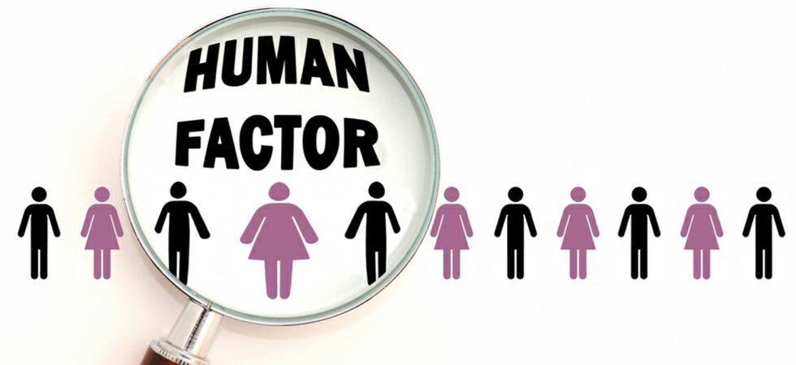

# space_apps_covid-19_challenge

On May 30-31, NASA, along with the European Space Agency (ESA), the Japan Aerospace Exploration Agency (JAXA), the Canadian Space Agency (CSA), and the National Centre for Space Studies (CNES), is inviting coders, entrepreneurs, scientists, designers, storytellers, makers, builders, artists, and technologists to participate in a virtual hackathon. During a period of 48 hours, participants from around the world will create virtual teams and use Earth observation data to develop solutions to issues related to the COVID-19 pandemic. Challenges will range from studying the coronavirus that causes COVID-19 and its spread to the impact the disease is having on the Earth system. The challenges will focus on the following thematic areas:  Learning about the virus and its spread using space-based data Local response/change and solutions Impacts of COVID-19 on the Earth system/Earth system response Economic opportunity, impact, and recovery during and following COVID-19 The unique capabilities of NASA and its partner space agencies in the areas of science and technology enable them to lend a hand during this global crisis. Since the start of the global outbreak, NASA, ESA, JAXA, CSA, and CNES Earth science specialists have been exploring ways to use unique Earth observation data to aid understanding of the interplay of the Earth system – on global to local scales – with aspects of the COVID-19 outbreak, including, potentially, our ability to combat it. The hackathon will also examine the human and economic response to the virus.

<h3>
The Challenge
</h3>

The emergence and spread of infectious diseases, like COVID-19, are on the rise. Can you identify patterns between population density and COVID-19 cases and identify factors that could help predict hotspots of disease spread?

<h3>
Explanation
</h3>

The emergence and spread of infectious diseases, like COVID-19, may well continue. Many factors, both environmental and anthropogenic, can contribute to this trend. This challenge explores human activities that may be directly or indirectly related to the spread of COVID-19 locally and around the globe.

Numerous factors can contribute to the spread of infectious diseases, including but not limited to: trade and travel, social activities that increase one’s risk of exposure, and the lack of proper hygiene infrastructure. Do geographic or temporal patterns from COVID-19 disease mapping reveal insights into human factors that may be related to the spread of the disease? Could human activities that impact the environment play an indirect role in furthering COVID-19 spread? Are certain activities correlated with specific disease presentations or increased severity?

Your challenge is to identify patterns between human activity and COVID-19 cases and identify factors that could help predict hotspots of disease spread.

<h3>
Considerations
</h3>

* Consider measuring density during COVID-19 by integrating space-based assets (such as satellite communications and Earth observations) with Earth-based infrastructure (such as buildings) to identify potential COVID-19 hotspots
* You may consider clustering in urban cities versus rural areas
* Consider derived social determinants of health (SDOH), population activity densities due to weather and weather events, and the related SDOH effects on the transmission and predictions of COVID-19.
* Are specific activities related to increased number of susceptible or exposed populations? What factors increase a population’s vulnerability to disease?

